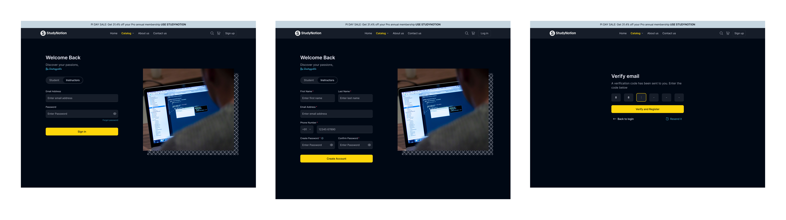

# StudyNotion Edtech Project

# StudyNotion
 - Developed using MERN stack. A fully functional Ed-tech platform that enables students to consume, and rate educational content and for instructors to showcase their expertise and create courses.

# Key functionalities that I've implemented:

 - For Students:

 - Homepage: This page will have a brief introduction to the platform, as well as links to the course list and user details.
 - Course List: This page will have a list of all the courses available on the platform, along with their descriptions and ratings.
 - Wishlist: This page will display all the courses that a student has added to their wishlist.
 - Cart Checkout: This page will allow the user to complete the course purchase.
 - Course Content: This page will have the course content for a particular course, including videos, and other related material.
 - User Details: This page will have details about the student's account, including their name, email, and other relevant information.
 - User Edit Details: This page will allow the student to edit their account details.

 - For Instructors:

 - Dashboard: This page will have an overview of the instructor's courses, as well as the ratings and feedback for each course.
 - Insights: This page will have detailed insights into the instructor's courses, including the number of views, clicks, and other relevant metrics.
 - Course Management Pages: These pages will allow the instructor to create, update, and delete courses, as well as manage the course content and pricing.
 - View and Edit Profile Details: These pages will allow the instructor to view and edit their account details.

# Frontend tech :
 - To build the front end, we use frameworks and libraries such as ReactJS, which is a popular JavaScript library for building user interfaces. 
 - We also use CSS and Tailwind, which are styling frameworks that help make the user interface look good and responsive. 
 - Additionally, we use some npm packages to add extra functionality to the front end. 
 - To manage the state of the applicatio,we use Redux, which is a popular state management library for React. 
 - Finally, we use a development environment called VSCode, which is a popular code editor, to develop the front end.

# Backend Tech :
- Frameworks, Libraries, and Tools used:

- The back end of StudyNotion uses a range of frameworks, libraries, and tools to ensure its functionality and performance, including:
Node.js: Node.js is used as the primary framework for the back end.
- MongoDB: MongoDB is used as the primary database, providing a flexible and scalable data storage solution.
- Express.js: Express.js is used as a web application framework, providing a range of features and tools for building web applications.
- JWT: JWT (JSON Web Tokens) are used for authentication and authorization, providing a secure and reliable way to manage user credentials.
- Bcrypt: Bcrypt is used for password hashing, adding an extra layer of security to user data.
- Mongoose: Mongoose is used as an Object Data Modeling (ODM) library, providing a way to interact with MongoDB using JavaScript.

### LoginPage

For more details or Collaboration, feel free to contact me at abrdhk@gmail.com.

Thanks
